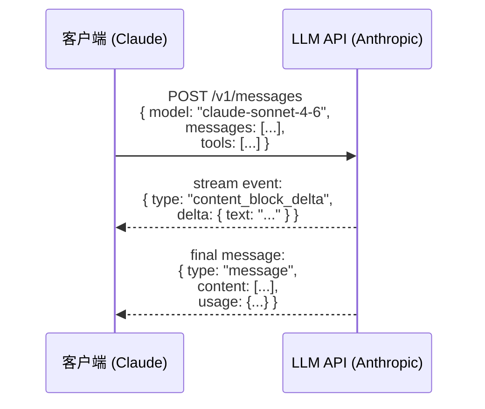
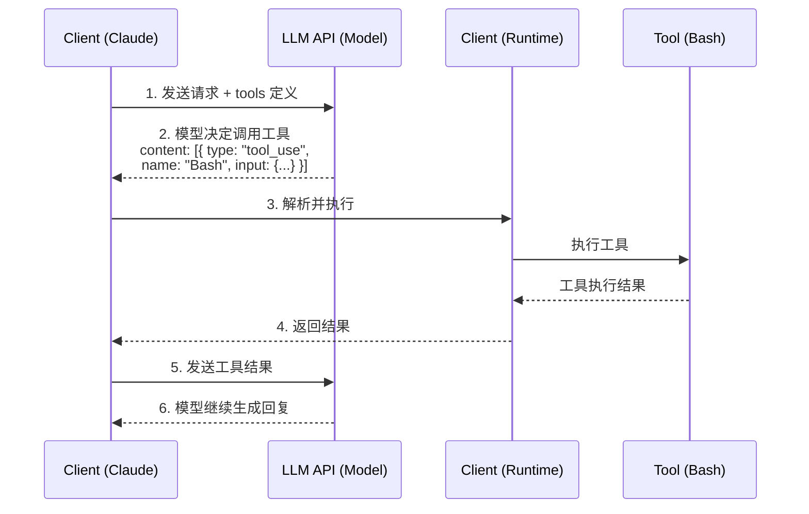

# 第 1 篇：LLM 基础与 Agent 概念

## 学习目标

- 理解 LLM API 的基本工作原理
- 掌握消息格式、工具调用、流式响应等核心概念
- 了解 Claude Code 如何与 Anthropic API 交互
- 为后续阅读代码打下理论基础

---

## 1.1 LLM API 基础

### 什么是 LLM API？

LLM（Large Language Model）API 是与大语言模型交互的编程接口。通过 API，你可以：

1. 发送消息（prompts）给模型
2. 接收模型生成的回复（completions）
3. 控制模型行为（温度、最大 token 数等）

### 基本交互流程



---

## 1.2 消息格式

### 消息角色（Role）

LLM API 使用对话式的消息格式，每条消息有一个角色：

| 角色 | 说明 | 示例 |
|------|------|------|
| `user` | 用户输入 | "帮我找出项目中的 bug" |
| `assistant` | 模型回复 | "我来分析一下代码..." |
| `tool_result` | 工具执行结果 | "文件已保存到..." |

### 消息结构

参考 `src/services/api/claude.ts` 中的类型定义：

```typescript
// 来自 @anthropic-ai/sdk 的类型
import type {
  BetaMessageParam as MessageParam,
  BetaContentBlockParam,
  BetaToolResultBlockParam,
} from '@anthropic-ai/sdk/resources/beta/messages/messages.mjs'

// 用户消息示例
const userMessage: MessageParam = {
  role: 'user',
  content: [
    {
      type: 'text',
      text: '帮我创建一个新文件'
    }
  ]
}

// 助手消息（包含工具调用）
const assistantMessage: MessageParam = {
  role: 'assistant',
  content: [
    {
      type: 'tool_use',
      id: 'tool_123',
      name: 'FileWriteTool',
      input: {
        path: '/tmp/test.txt',
        content: 'Hello World'
      }
    }
  ]
}

// 工具结果消息
const toolResultMessage: MessageParam = {
  role: 'user',
  content: [
    {
      type: 'tool_result',
      tool_use_id: 'tool_123',
      content: '文件已成功创建'
    }
  ]
}
```

### 消息对话历史

LLM 是有状态的，每次请求需要带上完整的对话历史：

```typescript
const messages: MessageParam[] = [
  // 第 1 轮
  { role: 'user', content: [{ type: 'text', text: '你好' }] },
  { role: 'assistant', content: [{ type: 'text', text: '你好！有什么可以帮助你的？' }] },

  // 第 2 轮
  { role: 'user', content: [{ type: 'text', text: '帮我写个文件' }] },
  {
    role: 'assistant',
    content: [
      { type: 'tool_use', id: 't1', name: 'FileWriteTool', input: {...} }
    ]
  },
  { role: 'user', content: [{ type: 'tool_result', tool_use_id: 't1', content: 'OK' }] },

  // 第 3 轮（当前）
  { role: 'user', content: [{ type: 'text', text: '再帮我做...' }] }
]
```

---

## 1.3 工具调用（Tool Use）

### 什么是工具调用？

工具调用允许 LLM 在执行过程中调用外部函数，扩展模型的能力边界。

### 工具定义格式

工具需要向模型描述其功能、参数和用途。参考 `src/Tool.ts`：

```typescript
export type Tool<
  Input extends AnyObject = AnyObject,
  Output = unknown,
> = {
  readonly name: string           // 工具名称，如 "Bash"
  description: (...) => Promise<string>  // 动态生成描述
  readonly inputSchema: Input     // Zod 验证 schema
  call: (...) => Promise<ToolResult<Output>>  // 执行函数

  // 其他元数据
  isConcurrencySafe: (input) => boolean
  isReadOnly: (input) => boolean
  // ...
}
```

### 工具调用流程



### Claude Code 中的工具注册

参考 `src/tools.ts`：

```typescript
// 导入所有工具
import { BashTool } from './tools/BashTool/BashTool.js'
import { FileReadTool } from './tools/FileReadTool/FileReadTool.js'
import { FileWriteTool } from './tools/FileWriteTool/FileWriteTool.js'
import { GrepTool } from './tools/GrepTool/GrepTool.js'
// ...

// 获取所有基础工具
export function getAllBaseTools(): Tools {
  return [
    AgentTool,
    BashTool,
    GlobTool,
    GrepTool,
    FileReadTool,
    FileEditTool,
    FileWriteTool,
    WebFetchTool,
    WebSearchTool,
    // ... 条件性加载的工具
  ]
}

// 根据权限上下文过滤工具
export const getTools = (permissionContext: ToolPermissionContext): Tools => {
  const tools = getAllBaseTools()
  // 过滤被拒绝的工具
  let allowedTools = filterToolsByDenyRules(tools, permissionContext)
  // 过滤未启用的工具
  const isEnabled = allowedTools.map(_ => _.isEnabled())
  return allowedTools.filter((_, i) => isEnabled[i])
}
```

---

## 1.4 流式响应（Streaming）

### 为什么需要流式？

LLM 生成回复是逐 token 进行的。流式响应允许：

1. **更快的首字显示** — 无需等待完整回复
2. **更好的用户体验** — 类似打字的动画效果
3. **工具调用的实时处理** — 边解析边执行

### 流式事件类型

Anthropic API 的流式事件包括：

```typescript
// 来自 src/services/api/claude.ts

type StreamEvent =
  | { type: 'message_start', message: BetaMessage }
  | { type: 'content_block_start', index: number, content_block: ContentBlock }
  | { type: 'content_block_delta', index: number, delta: { type: 'text_delta', text: string } }
  | { type: 'content_block_delta', index: number, delta: { type: 'input_json_delta', partial_json: '{"p' } }
  | { type: 'content_block_stop', index: number }
  | { type: 'message_delta', delta: { stop_reason: 'end_turn' | 'tool_use' } }
  | { type: 'message_stop' }
  | { type: 'error', error: { message: string } }
```

### 流式处理示例

参考 `src/services/api/claude.ts` 中的流式处理逻辑：

```typescript
// 简化的流式处理伪代码
async function streamCompletion(params: StreamParams) {
  const stream = await client.messages.stream({
    model: params.model,
    messages: params.messages,
    tools: params.tools,
    max_tokens: params.maxTokens,
  })

  // 处理流式事件
  for await (const event of stream) {
    switch (event.type) {
      case 'content_block_start':
        // 内容块开始
        if (event.content_block.type === 'tool_use') {
          // 工具调用开始
          startToolUse(event.content_block.id, event.content_block.name)
        }
        break

      case 'content_block_delta':
        // 内容增量
        if (event.delta.type === 'text_delta') {
          // 文本追加
          appendToCurrentText(event.delta.text)
        } else if (event.delta.type === 'input_json_delta') {
          // 工具输入 JSON 追加
          appendToToolInput(event.delta.partial_json)
        }
        break

      case 'content_block_stop':
        // 内容块结束
        if (currentToolUse) {
          // 执行工具
          const result = await executeTool(currentToolUse)
        }
        break

      case 'message_delta':
        // 消息结束
        if (event.delta.stop_reason === 'tool_use') {
          // 模型需要执行工具，继续下一轮
          continue
        }
        break
    }
  }
}
```

---

## 1.5 Token 与计费

### 什么是 Token？

Token 是 LLM 处理文本的基本单位。大致对应：
- 英文：1 token ≈ 4 个字符 ≈ 3/4 个单词
- 中文：1 token ≈ 1.5 个汉字

### Token 计算

```typescript
// 来自 src/utils/tokens.ts 的简化版本
function countTokens(text: string): number {
  // 实际实现更复杂，这里简化
  return Math.ceil(text.length / 4)
}

// API 调用中的 token 统计
const usage: BetaUsage = {
  input_tokens: 1500,      // 输入 token 数
  output_tokens: 800,      // 输出 token 数
  cache_creation_input_tokens: 0,  // 缓存创建
  cache_read_input_tokens: 0,      // 缓存读取
}
```

### Claude Code 中的计费追踪

```typescript
// 来自 src/cost-tracker.ts
import { calculateUSDCost } from './utils/modelCost.js'

function addToTotalSessionCost(model: string, usage: BetaUsage) {
  const cost = calculateUSDCost(model, usage)
  // 累加到会话总成本
  // 更新 UI 显示
}
```

---

## 1.6 系统提示（System Prompt）

### 什么是系统提示？

系统提示是在对话开始前设定的指令，用于：

1. 设定模型的角色和行为
2. 定义工具使用规范
3. 注入上下文信息

### Claude Code 的系统提示结构

参考 `src/utils/systemPrompt.ts`：

```typescript
// 系统提示由多个部分组成
const systemPrompt = `
# 角色定义
你是一个强大的 AI 助手，运行在命令行环境中...

# 工具使用规范
- 在调用工具前，先解释你的意图
- 每次只调用一个工具
- 等待工具结果后再继续

# 可用工具
${tools.map(t => `- ${t.name}: ${t.description()}`).join('\n')}

# 环境信息
当前目录：${process.cwd()}
操作系统：${process.platform}
...
`
```

### 系统提示的缓存优化

```typescript
// 来自 src/services/api/claude.ts
// 系统提示可以缓存在服务器端，减少每次请求的 token 消耗
const cacheScope: CacheScope = shouldUseGlobalCacheScope()
  ? 'global'
  : 'user'
```

---

## 1.7 错误处理

### API 错误类型

```typescript
// 来自 src/services/api/errors.ts
import { APIError, APIConnectionTimeoutError, APIUserAbortError } from '@anthropic-ai/sdk/error'

// 常见错误类型
// - APIError: API 返回错误
// - APIConnectionTimeoutError: 连接超时
// - APIUserAbortError: 用户主动中断
```

### 重试机制

参考 `src/services/api/withRetry.ts`：

```typescript
// 带重试的 API 调用包装器
export async function withRetry<T>(
  fn: () => Promise<T>,
  context: RetryContext = {}
): Promise<T> {
  const maxRetries = context.maxRetries ?? 3

  for (let attempt = 1; attempt <= maxRetries; attempt++) {
    try {
      return await fn()
    } catch (error) {
      if (shouldRetry(error, attempt)) {
        const delay = calculateBackoff(attempt)
        await sleep(delay)
        continue
      }
      throw error
    }
  }
}

function shouldRetry(error: Error, attempt: number): boolean {
  // 可重试的错误
  if (error instanceof APIConnectionTimeoutError) return true
  if (is529Error(error)) return true  // 速率限制
  if (attempt < 3 && isServerError(error)) return true

  return false
}
```

---

## 1.8 实战：编写一个简单的 LLM 调用

下面是一个简化的 LLM 调用示例，帮助理解核心概念：

```typescript
// 简化的 API 调用示例
import Anthropic from '@anthropic-ai/sdk'

const client = new Anthropic({
  apiKey: process.env.ANTHROPIC_API_KEY,
})

async function simpleChat(prompt: string) {
  // 1. 准备消息
  const messages = [
    { role: 'user', content: prompt }
  ]

  // 2. 调用 API
  const response = await client.messages.create({
    model: 'claude-sonnet-4-6-20250929',
    max_tokens: 1024,
    messages,
  })

  // 3. 提取回复
  const reply = response.content[0]
  if (reply.type === 'text') {
    console.log('模型回复:', reply.text)
  }
}

// 带工具的调用
async function chatWithTools(prompt: string) {
  // 1. 定义工具
  const tools = [
    {
      name: 'get_weather',
      description: '获取指定城市的天气',
      input_schema: {
        type: 'object',
        properties: {
          city: { type: 'string', description: '城市名称' }
        },
        required: ['city']
      }
    }
  ]

  // 2. 调用 API
  const response = await client.messages.create({
    model: 'claude-sonnet-4-6-20250929',
    max_tokens: 1024,
    messages: [{ role: 'user', content: prompt }],
    tools,
  })

  // 3. 处理回复（可能包含工具调用）
  for (const block of response.content) {
    if (block.type === 'tool_use') {
      console.log('模型要调用工具:', block.name)
      console.log('工具输入:', block.input)

      // 4. 执行工具
      const toolResult = await executeTool(block.name, block.input)

      // 5. 发送工具结果，获取后续回复
      const followUp = await client.messages.create({
        model: 'claude-sonnet-4-6-20250929',
        max_tokens: 1024,
        messages: [
          { role: 'user', content: prompt },
          { role: 'assistant', content: response.content },
          {
            role: 'user',
            content: [{
              type: 'tool_result',
              tool_use_id: block.id,
              content: toolResult
            }]
          }
        ],
        tools,
      })

      console.log('最终回复:', followUp.content)
    }
  }
}
```

---

## 1.9 Claude Code 的 API 调用架构

### 核心文件：`src/services/api/claude.ts`

这个文件包含了与 Anthropic API 交互的核心逻辑：

```typescript
// 简化的核心调用逻辑（来自 claude.ts）
export async function runQuery(
  params: QueryParams
): AsyncGenerator<StreamEvent> {
  const {
    messages,
    tools,
    systemPrompt,
    model,
    thinkingConfig
  } = params

  // 1. 准备 API 参数
  const apiParams = {
    model: normalizeModelStringForAPI(model),
    messages: normalizeMessagesForAPI(messages),
    tools: tools.map(tool => toolToAPISchema(tool)),
    system: systemPrompt,
    max_tokens: getModelMaxOutputTokens(model),
    // ... 其他参数
  }

  // 2. 发送请求并获取流
  const stream = await getAnthropicClient().messages.stream(apiParams)

  // 3. 处理流式事件
  for await (const event of stream) {
    // 转换并转发事件
    yield convertEvent(event)

    // 处理特殊事件
    if (event.type === 'content_block_start' &&
        event.content_block.type === 'tool_use') {
      // 记录工具调用开始
    }
  }

  // 4. 返回最终结果
  const finalMessage = await stream.finalMessage()
  return processMessage(finalMessage)
}
```

---

## 1.10 关键概念总结

| 概念 | 说明 | 在代码中的位置 |
|------|------|---------------|
| **MessageParam** | 消息格式，包含 role 和 content | `@anthropic-ai/sdk` 类型 |
| **Tool** | 工具定义，包含 name、description、input_schema | `src/Tool.ts` |
| **StreamEvent** | 流式事件，如 content_block_delta | `src/services/api/claude.ts` |
| **System Prompt** | 系统提示，设定模型行为 | `src/utils/systemPrompt.ts` |
| **Usage** | Token 统计，用于计费 | `@anthropic-ai/sdk` 类型 |
| **Retry** | 重试机制，处理临时错误 | `src/services/api/withRetry.ts` |

---

## 课后练习

1. **阅读代码**：打开 `src/services/api/claude.ts`，找到消息处理相关的函数
2. **理解工具定义**：查看 `src/Tool.ts`，理解 `Tool` 类型的各个字段
3. **思考问题**：
   - 为什么要使用流式 API 而不是等待完整响应？
   - 工具调用的消息历史为什么需要包含 tool_result？
   - 系统提示和普通消息有什么区别？

---

**下一步**：[第 2 篇 — Agent 架构入门](./02-agent-architecture-introduction.md)
