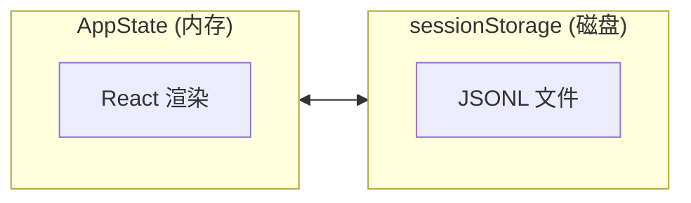

# 第 4 篇：会话与状态管理

## 学习目标

- 理解多轮对话的上下文管理
- 掌握状态持久化和恢复机制
- 学习会话边界处理
- 了解消息链的组织和存储

---

## 4.1 会话存储结构

### 会话文件组织

```typescript
// 来自 src/utils/sessionStorage.ts
// 会话存储目录结构
// ~/.claude/projects/<project_hash>/
//   └── <session_id>.jsonl

export function getProjectsDir(): string {
  return join(getClaudeConfigHomeDir(), 'projects')
}

function getSessionDir(sessionId: UUID): string {
  const projectDir = getProjectDir(getCwd())
  return join(projectDir, sessionId)
}
```

### 会话元数据

```typescript
// 来自 src/utils/sessionStorage.ts
type SessionMetadata = {
  sessionId: UUID
  title: string | undefined
  createdAt: number
  updatedAt: number
  projectDir: string
  originalCwd: string
}

// 保存会话元数据
export function cacheSessionTitle(sessionId: UUID, title: string): void {
  const metadataPath = get_session_metadata_dir(sessionId)
  writeFileSync(metadataPath, JSON.stringify({
    title,
    timestamp: Date.now()
  }))
}
```

---

## 4.2 消息格式和类型

### 消息类型定义

```typescript
// 来自 src/types/message.ts
export type Message =
  | UserMessage           // 用户消息
  | AssistantMessage      // 助手消息
  | SystemMessage         // 系统消息
  | AttachmentMessage     // 附件消息
  | ProgressMessage       // 进度消息（不持久化）

export type UserMessage = {
  type: 'user'
  uuid: UUID
  parentUuid: UUID | null
  message: UserMessageParam
  timestamp: number
}

export type AssistantMessage = {
  type: 'assistant'
  uuid: UUID
  parentUuid: UUID | null
  message: AssistantMessageParam
  timestamp: number
  toolUses?: ToolUseBlock[]
}

export type SystemMessage = {
  type: 'system'
  uuid: UUID
  parentUuid: UUID | null
  subtype:
    | 'local_command'   // 本地命令（如 /help）
    | 'compact_boundary' // 压缩边界
    | 'queue_operation' // 队列操作
  content: string
  timestamp: number
}
```

### 消息链组织

```typescript
// 消息通过 parentUuid 形成链式结构
//
// user (uuid: 1, parentUuid: null)
//   └─> assistant (uuid: 2, parentUuid: 1)
//         └─> user (uuid: 3, parentUuid: 2)
//               └─> assistant (uuid: 4, parentUuid: 3)

export function isChainParticipant(m: Pick<Message, 'type'>): boolean {
  // 只有这些消息类型参与 parentUuid 链
  return m.type !== 'progress'
}
```

---

## 4.3 会话持久化

### JSONL 格式存储

```typescript
// 来自 src/utils/sessionStorage.ts
// JSONL (JSON Lines) 格式 — 每行一个 JSON 对象
//
// 文件内容示例：
// {"type":"user","uuid":"abc-123","parentUuid":null,"message":{...},"timestamp":1234567890}
// {"type":"assistant","uuid":"def-456","parentUuid":"abc-123","message":{...},"timestamp":1234567891}
// {"type":"system","uuid":"ghi-789","parentUuid":"def-456","subtype":"local_command","content":"帮助用户","timestamp":1234567892}

/**
 * 追加消息到会话日志
 */
export async function appendMessage(
  sessionId: UUID,
  entry: Entry,
): Promise<void> {
  const logPath = getLogPath(sessionId)

  // 确保目录存在
  await mkdir(dirname(logPath), { recursive: true })

  // 追加 JSONL 行
  const line = jsonStringify(entry) + '\n'
  await fsAppendFile(logPath, line)
}
```

### 读取会话日志

```typescript
// 来自 src/utils/sessionStorage.ts
/**
 * 加载会话日志
 *
 * 优化策略：
 * 1. 对于大文件，只读取头部和尾部
 * 2. 跳过临时进度消息
 * 3. 修复旧格式的进度消息链
 */
export async function loadTranscriptFile(
  sessionId: UUID,
): Promise<TranscriptMessage[]> {
  const logPath = getLogPath(sessionId)

  // 读取完整文件
  const content = await readFile(logPath, 'utf-8')
  const entries = parseJSONL(content)

  // 过滤只保留 transcript 消息
  const transcriptMessages = entries.filter(isTranscriptMessage)

  // 跳过临时进度消息
  const filtered = transcriptMessages.filter(entry => {
    if (entry.type === 'progress') {
      return !isEphemeralToolProgress(entry.data?.type)
    }
    return true
  })

  return filtered
}
```

---

## 4.4 会话恢复

### 恢复流程

```typescript
// 来自 src/utils/conversationRecovery.ts
/**
 * 加载会话用于恢复
 */
export function loadConversationForResume(
  sessionId: UUID,
): MessageType[] | null {
  const sessionPath = getSessionFilePath(sessionId)

  try {
    const content = readFileSync(sessionPath)
    const data = JSON.parse(content)
    return data.messages
  } catch (e) {
    if (isENOENT(e)) {
      return null  // 会话不存在
    }
    logError(e)
    return null
  }
}
```

### 会话恢复处理

```typescript
// 来自 src/utils/sessionRestore.ts
/**
 * 处理恢复的会话
 * - 验证消息链完整性
 * - 重建状态
 * - 检测需要重新执行的操作
 */
export function processResumedConversation(
  messages: Message[],
): ProcessedResume {
  // 1. 验证链完整性
  const uuidSet = new Set(messages.map(m => m.uuid))
  const orphanMessages: Message[] = []

  for (const message of messages) {
    if (message.parentUuid && !uuidSet.has(message.parentUuid)) {
      orphanMessages.push(message)
    }
  }

  // 2. 检查未完成的工具调用
  const pendingToolUses: ToolUseBlock[] = []
  for (const message of messages) {
    if (message.type === 'assistant' && message.toolUses) {
      for (const toolUse of message.toolUses) {
        // 检查是否有对应的 tool_result
        const hasResult = messages.some(
          m => m.type === 'user' &&
               m.message.content?.some(c => c.tool_use_id === toolUse.id)
        )
        if (!hasResult) {
          pendingToolUses.push(toolUse)
        }
      }
    }
  }

  return {
    messages,
    orphanMessages,
    pendingToolUses,
  }
}
```

---

## 4.5 状态管理

### AppState 结构

```typescript
// 来自 src/state/AppStateStore.ts
export type AppState = {
  // 设置
  settings: SettingsJson
  verbose: boolean
  mainLoopModel: ModelSetting

  // UI 状态
  statusLineText: string | undefined
  expandedView: 'none' | 'tasks' | 'teammates'

  // 消息和会话
  messages: Message[]
  sessionId: UUID

  // 任务状态
  tasks: { [taskId: string]: TaskState }

  // MCP 状态
  mcp: {
    clients: MCPServerConnection[]
    tools: Tool[]
    resources: Record<string, ServerResource[]>
  }

  // 权限上下文
  toolPermissionContext: ToolPermissionContext
}
```

### 状态更新模式

```typescript
// 来自 src/state/store.ts
/**
 * Redux-like 状态存储
 */
export type Store<T> = {
  getState: () => T
  setState: (updater: T | ((prev: T) => T)) => void
  subscribe: (listener: () => void) => () => void
}

export function createStore<T>(
  initialState: T,
  onChange?: (args: { newState: T; oldState: T }) => void
): Store<T> {
  let state = initialState
  const listeners = new Set<() => void>()

  return {
    getState: () => state,

    setState: (updater) => {
      const oldState = state
      const newState = typeof updater === 'function'
        ? (updater as (prev: T) => T)(oldState)
        : updater

      // 优化：状态未变时不通知
      if (Object.is(oldState, newState)) return

      state = newState
      listeners.forEach(listener => listener())
      onChange?.({ newState, oldState })
    },

    subscribe: (listener) => {
      listeners.add(listener)
      return () => listeners.delete(listener)
    }
  }
}
```

---

## 4.6 会话切换

```typescript
// 来自 src/bootstrap/state.ts
let sessionId: UUID
let sessionSource: SessionSource = 'new'

export function getSessionId(): UUID {
  return sessionId
}

/**
 * 切换到新会话
 */
export function switchSession(newSessionId?: UUID): void {
  sessionId = newSessionId ?? randomUUID()
  sessionSource = newSessionId ? 'existing' : 'new'

  // 持久化会话元数据
  saveSessionMetadata(sessionId)
}

/**
 * 序列化会话 ID 用于类型安全
 */
export function asSessionId(uuid: UUID): SessionId {
  return uuid as SessionId
}
```

---

## 4.7 会话标题生成

```typescript
// 来自 src/utils/sessionStorage.ts
/**
 * 从会话中提取第一个有意义的用户消息作为标题
 */
export function extractFirstPrompt(
  messages: TranscriptMessage[],
): string | null {
  for (const message of messages) {
    if (message.type === 'user') {
      const text = extractTextContent(message.message)
      // 跳过非实质性消息（IDE 上下文、Hook 输出等）
      if (!SKIP_FIRST_PROMPT_PATTERN.test(text)) {
        return truncate(text, 50)
      }
    }
  }
  return null
}

/**
 * 缓存会话标题
 */
export async function cacheSessionTitle(
  sessionId: UUID,
  title: string,
): Promise<void> {
  const metadataPath = get_session_metadata_dir(sessionId)

  try {
    await mkdir(dirname(metadataPath), { recursive: true })
    await writeFile(metadataPath, JSON.stringify({
      title,
      timestamp: Date.now(),
    }))

    // 更新内存缓存
    updateSessionName(sessionId, title)
  } catch (e) {
    logError(e)
  }
}
```

---

## 4.8 会话清理

###  Tombstone 重写

```typescript
// 来自 src/utils/sessionStorage.ts
/**
 * 当会话文件过大时，重写 tombstone 标记
 * 防止 OOM 问题
 */
const MAX_TOMBSTONE_REWRITE_BYTES = 50 * 1024 * 1024  // 50MB

async function rewriteTombstone(sessionPath: string): Promise<void> {
  const content = await readFile(sessionPath, 'utf-8')

  if (content.length > MAX_TOMBSTONE_REWRITE_BYTES) {
    // 只保留必要的元数据
    const minimal = extractMinimalMetadata(content)
    await writeFile(sessionPath, minimal)
  }
}
```

### 过期会话清理

```typescript
// 来自 src/utils/sessionCleanup.ts
/**
 * 清理过期会话
 */
export async function cleanupExpiredSessions(
  maxAgeDays: number = 30,
): Promise<number> {
  const projectsDir = getProjectsDir()
  const cutoff = Date.now() - (maxAgeDays * 24 * 60 * 60 * 1000)
  let cleaned = 0

  for (const project of await readdir(projectsDir)) {
    const projectPath = join(projectsDir, project)

    for (const sessionFile of await readdir(projectPath)) {
      const stats = await stat(join(projectPath, sessionFile))

      if (stats.mtimeMs < cutoff) {
        await unlink(join(projectPath, sessionFile))
        cleaned++
      }
    }
  }

  return cleaned
}
```

---

## 4.9 工作树（Worktree）会话

```typescript
// 来自 src/utils/sessionStorage.ts
/**
 * Worktree 会话持久化
 * 保存 worktree 特定状态
 */
type PersistedWorktreeSession = {
  sessionId: UUID
  worktreePath: string
  branch: string
  messages: TranscriptMessage[]
  fileHistory: FileHistorySnapshot
}

export async function saveWorktreeSession(
  sessionId: UUID,
  worktreePath: string,
): Promise<void> {
  const worktreePaths = await getWorktreePaths()
  const branch = await getBranch(worktreePath)

  const persisted: PersistedWorktreeSession = {
    sessionId,
    worktreePath,
    branch,
    messages: await loadTranscriptFile(sessionId),
    fileHistory: getFileHistorySnapshot(),
  }

  const persistPath = join(worktreePath, '.claude', 'session.json')
  await writeFile(persistPath, jsonStringify(persisted))
}
```

---

## 4.10 关键设计要点

### 1. JSONL 格式优势

- **增量追加** — 无需重写整个文件
- **容错性** — 单行损坏不影响其他数据
- **流式读取** — 可边读边处理

### 2. 链式消息组织

```
parentUuid 链：
null ← user(1) ← assistant(2) ← user(3) ← assistant(4)

优势：
- 清晰的对话脉络
- 支持分支（如假设性推理）
- 便于恢复和重放
```

### 3. 状态与持久化分离



### 4. 惰性加载策略

```typescript
// 大文件优化：只加载需要的部分
export async function readHeadAndTail(
  path: string,
  headBytes: number = 1024 * 1024,
  tailBytes: number = 1024 * 1024,
): Promise<{ head: string; tail: string }> {
  // 只读取头部和尾部 2MB
  // 中间部分在需要时再加载
}
```

---

## 4.11 关键代码位置索引

| 功能 | 文件路径 | 关键函数/类型 |
|------|----------|---------------|
| 会话存储 | `src/utils/sessionStorage.ts` | `loadTranscriptFile`, `cacheSessionTitle` |
| 会话恢复 | `src/utils/conversationRecovery.ts` | `loadConversationForResume` |
| 会话恢复处理 | `src/utils/sessionRestore.ts` | `processResumedConversation` |
| 状态管理 | `src/state/AppStateStore.ts` | `AppState`, `useAppState` |
| 状态存储 | `src/state/store.ts` | `createStore` |
| 会话切换 | `src/bootstrap/state.ts` | `switchSession`, `getSessionId` |
| 消息类型 | `src/types/message.ts` | `Message`, `UserMessage`, `AssistantMessage` |
| 日志类型 | `src/types/logs.ts` | `Entry`, `TranscriptMessage` |

---

## 课后练习

1. **阅读代码**：
   - 打开 `src/utils/sessionStorage.ts`，查看 `isTranscriptMessage` 函数
   - 打开 `src/types/message.ts`，了解各消息类型的结构
   - 打开 `src/state/store.ts`，理解状态存储的实现

2. **思考问题**：
   - 为什么使用 JSONL 而不是纯 JSON 格式？
   - parentUuid 链的设计有什么好处？
   - 如何正确处理会话恢复时的未完成工具调用？

3. **实践**：
   - 设计一个会话存储格式
   - 实现简单的会话加载和保存功能

---

**下一步**：[第 5 篇 — 权限与安全控制](./05-permission-and-security-control.md)
